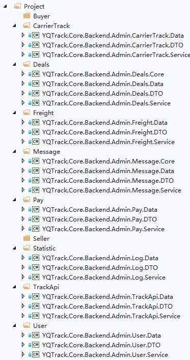
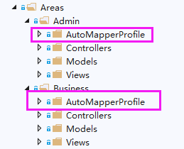
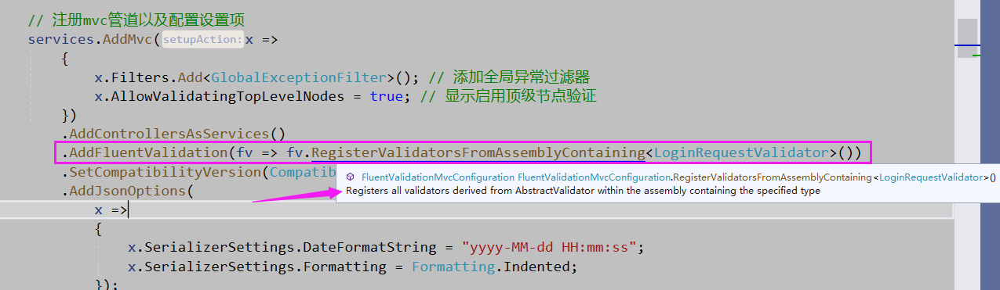
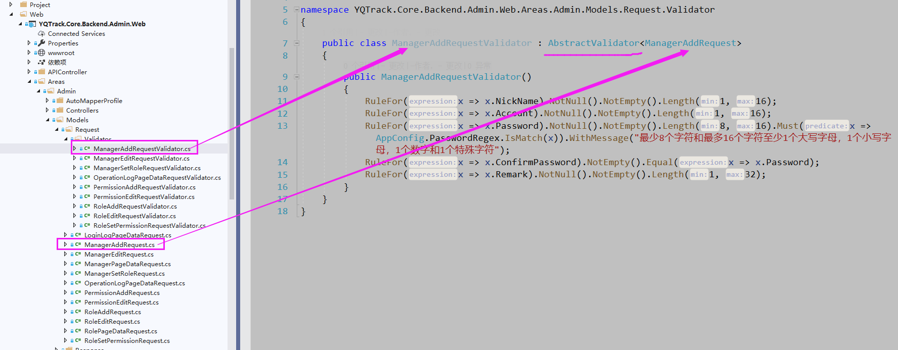

# IMS后台系统搭建技术分享

## 前言

> 可能需要分享的点 , 一个小点都可以细讲 , 所以我这边大致罗列一下我觉得可以分享的一些点给大伙说活 , 其他的地方大家大家感兴趣可以提问,问了可能我也可能回答不上,23333

看了一下最先的git提交记录是9个月前 , 也就是今年年初开始的了 , 随后到后面大致2个月之后基本的基于角色的权限认证系统初见雏形 , 再到后面越来越多的项目加入 , 下图可见:

一开始就我一个人开发 , 所以基本不太需要基本的挤入开发指引 , 但是到了后面越来越来的人基于IMS开发增加自己的项目功能就需要大概的指引 , 方便整个项目的维护 , 所以这个分享还是很有必要的( 也是拖了很长时间的一个东西了 , 还债来了 , 2333333 )

## 技术大纲

> 这里罗列一些用到的主要的技术

1. 基于 .NET CORE 2.2 开发 , 包含主要的微软的技术框架有: ASP.NET CORE 2.2 + EntityFramework Core 2.2
2. AspectCore.Core 用于AOP拦截面
3. AutoMapper OTO对象映射工具
4. AspectCore.Extensions.DependencyInjection 结合扩展asp.net core的Ioc容器
5. BuildBundlerMinifier
6. EPPlus.Core
7. FluentValidation.AspNetCore
8. Microsoft.Extensions.Logging.Log4Net.AspNetCore
9. System.Drawing.Common 用于验证码的图片库

## 项目结构说明

* YQTrack.Core.Backend.Admin.Core 扩展方法核心库
* YQTrack.Core.Backend.Admin.Data 权限模块数据库映射 *DbContext以及版本迁移
* YQTrack.Core.Backend.Admin.DTO 传输层
* YQTrack.Core.Backend.Admin.Service 服务层
* YQTrack.Core.Backend.Admin.WebCore Web核心库
* YQTrack.Core.Backend.Admin.Freight.Data 报价模块数据库 *映射DbContext以及版本迁移
* YQTrack.Core.Backend.Admin.Freight.DTO 传输层
* YQTrack.Core.Backend.Admin.Freight.Service 服务层
* YQTrack.Core.Backend.Admin.Web 网站APP宿主
* XUnitTest 单元测试

### YQTrack.Core.Backend.Admin.Web

Area区域: 按照业务区域划分,区域内部文件排版和格式还是划分同理

Views视图: 需要严格按照对应controller+action的关系

Models: 分为 Request + Reponse 的划分区分,对应请求的输入和输出,同时命名需要按照对应的后缀统一, 对于 Validators 需要保持 Request的前缀加上Validator的后缀风格一致

Common: 存放一个web层公共的基础组件

AutoMapperProfile: 存放automapper的配置映射文件

Controllers: 控制器里面的Action需要明确标记访问的权限代码(例如:[PermissionCode("Home_" + nameof(Index))])

### YQTrack.Core.Backend.Admin.Freight.Service

存放一系类业务相关的接口文件,以及接口的实现文件夹:Imp,皆保持Service的后缀命名,且如果是范围作用域的接口需要继承IScopeService,这样保证App启动自动注入Scope方式接口和实现

### YQTrack.Core.Backend.Admin.Freight.DTO

包含 Input + Output 分别对应 Web层的 Request + Response 文件夹的Class,同理命名保持语义上面的一致性

### YQTrack.Core.Backend.Admin.Data

* Entity文件夹: 数据库对应表映射实体
* Entity/Mapping文件夹: 数据库对应表字段格式配置映射
* Interceptor: 拦截器
* Migrations: 数据库版本迁移历史纪录

举个例子: 利用 ef tool 直接逆向DB生成code first代码方便构建对应的数据库表的实体类( 具体可以参照微软官方文档: https://docs.microsoft.com/zh-cn/ef/core/ )

```sql
Scaffold-DbContext 'Data Source=192.168.1.206;Initial Catalog=YQTrackV6_Pay2;User ID=sa;password=sa17track.net;' Microsoft.EntityFrameworkCore.SqlServer -UseDatabaseNames -Tables TBusinessType, TCurrency, TExchangeRate, TPayment, TPaymentLog, TProduct, TProductCategory, TProductSku, TProductSkuPrice, TProvider, TProviderType, TProviderTypeCurrency, TPurchaseOrder, TPurchaseOrderItem, TReconcile, TReconcileItem, TSequence, TSerialNo -Context PayDbContext -OutputDir Models
```

## 启动代码Startp.cs解析

直接看代码以及大致注释即可

## 基于角色的权限认证流程解析

主要依靠此类: PermissionCheckActionFilter.cs 来统一鉴权( 建议感兴趣直接看代码,流程比较简单 )

通过此类: PermissionCodeAttribute.cs 辅助标记 , 将我们的MVC种的Action用权限代码PermissionCode来别名

## 方便且省力的一些开发技术

### AutoMapper在.NET Core的使用

```csharp
// 批量注册automapper映射配置文件
var profileTypes = allTypes.Where(x => x.IsSubclassOf(typeof(Profile)) && !x.IsAbstract);
Mapper.Initialize(x => x.AddProfiles(profileTypes));
Mapper.Configuration.CompileMappings();
var mapper = Mapper.Configuration.CreateMapper();
services.AddSingleton(mapper);
```



```csharp
public abstract class BaseProfile : Profile
{
    protected BaseProfile()
    {
        RecognizePrefixes("F");
        RecognizeDestinationPrefixes("F");
    }
}

public class ProductCategoryProfile : BaseProfile
{
    public ProductCategoryProfile()
    {
        CreateMap<ProductCategoryPageDataRequest, ProductCategoryPageDataInput>();

        CreateMap<ProductCategoryPageDataOutput, ProductCategoryPageDataResponse>()
            .ForMember(
                dest => dest.CreateAt,
                opt => opt.MapFrom(src => src.FCreateAt.ToLocalTime())
            ).ForMember(
                dest => dest.UpdateAt,
                opt => opt.MapFrom(src => src.FUpdateAt.ToLocalTime())
            );

        CreateMap<ProductCategoryAddRequest, ProductCategoryAddInput>();
        CreateMap<ProductCategoryAddInput, TProductCategory>()
            .ForMember(
                dest => dest.FDescription,
                opt => opt.MapFrom(src => src.Desc)
            );

        CreateMap<TProductCategory, ProductCategoryOutput>()
            .ForMember(
                dest => dest.Id,
                opt => opt.MapFrom(src => src.FProductCategoryId)
            );
        CreateMap<ProductCategoryOutput, ProductCategoryResponse>();
    }
}
```

### FluentValidation.AspNetCore 请求数据验证拦截器使用





### AspectCore AOP以及IOC

我们都知道AOP和IOC的意义和作用 , 这里我们直接看怎么在.netcore中使用它们来方便我们开发和实践

> ioc部分asp.netcore直接内置了IServiceProvider以及IServiceCollection等组件来支撑依赖注入的技术实现,但是依然没有实现属性注入,所以我这边使用了上述技术补充这个缺失,其次AOP方法我们可以做到例如Cache拦截|方法调用记录审查等等,使其拦截粒度更加细致且可控

```csharp
// 注册第三方ioc + 默认启用方法级别的aop
var serviceContainer = services.ToServiceContainer();
var serviceResolver = serviceContainer.Build();
return serviceResolver;
```

> 例如OperationTracePlusAttribute操作拦截记录器+通过Mediator发送进程内的Event事件实现接口方法操作记录

```csharp
/// <summary>
/// 业务操作跟踪拦截器(加强版)
/// 通过Mediator发送进程内的Event事件,提高逻辑分离且提升性能
/// </summary>
[AttributeUsage(AttributeTargets.Method | AttributeTargets.Interface | AttributeTargets.Class, AllowMultiple = false, Inherited = false)]
public class OperationTracePlusAttribute : AbstractInterceptorAttribute
{
private readonly string _desc;
private readonly OperationType _type;

/// <summary>
/// 业务操作跟踪拦截器
/// </summary>
/// <param name="desc">业务操作描述</param>
/// <param name="type">操作类型</param>
public OperationTracePlusAttribute(string desc, OperationType type)
{
    if (desc.IsNullOrWhiteSpace())
    {
        throw new ArgumentNullException(nameof(desc));
    }
    _desc = desc;
    _type = type;
}

public override async Task Invoke(AspectContext context, AspectDelegate next)
{
    await next(context);
    var httpContextAccessor = context.ServiceProvider.ResolveRequired<IHttpContextAccessor>();
    var userClaims = httpContextAccessor.HttpContext?.User?.Claims.ToList();
    if (userClaims != null && userClaims.Any(x => x.Type == ClaimTypes.Sid) && userClaims.Any(x => x.Type == ClaimTypes.Name) && userClaims.Any(x => x.Type == ClaimTypes.NameIdentifier))
    {
        var operatorId = int.Parse(userClaims.Single(x => x.Type == ClaimTypes.Sid).Value);
        var parameters = context.GetParameters().Select(x => new { x.Name, x.Value, Type = x.Type.ToString() });
        var @event = new OperationLogEvent
        {
            FAccount = userClaims.Single(x => x.Type == ClaimTypes.NameIdentifier).Value,
            FCreatedBy = operatorId,
            FDesc = _desc,
            FIp = httpContextAccessor.HttpContext.Connection.RemoteIpAddress.ToString(),
            FOperatorId = operatorId,
            FMethod = $"{context.ServiceMethod.DeclaringType.FullName}_{context.ProxyMethod.Name}",
            FNickName = userClaims.Single(x => x.Type == ClaimTypes.Name).Value,
            FOperationType = _type,
            FParameter = JsonConvert.SerializeObject(parameters)
        };
        var mediator = context.ServiceProvider.ResolveRequired<IMediator>();
        await mediator.Publish(@event);
    }
}
}
```

### efcore配合AutoMapper.QueryableExtensions使用介绍

> 流畅的lambda表达式加上根据属性自动Select选择映射实体类型,加速方便开发者,也间接省略了匿名类型

```csharp
public async Task<(IEnumerable<LoginLogPageDataOutput> outputs, int total)> GetLoginLogPageDataAsync(LoginLogPageDataInput input)
{
    var query = _dbContext.LoginLog
        .WhereIf(() => !input.Account.IsNullOrWhiteSpace(), x => x.FAccount.Contains(input.Account.Trim()))
        .WhereIf(() => !input.NickName.IsNullOrWhiteSpace(), x => x.FNickName.Contains(input.NickName.Trim()))
        .WhereIf(() => !input.Platform.IsNullOrWhiteSpace(), x => x.FPlatform == input.Platform.Trim());
    var count = await query.CountAsync();
    var outputs = await query
        .OrderByDescending(x => x.FCreatedTime).ToPage(input.Page, input.Limit).ProjectTo<LoginLogPageDataOutput>().ToListAsync();
    return (outputs, count);
}
```
